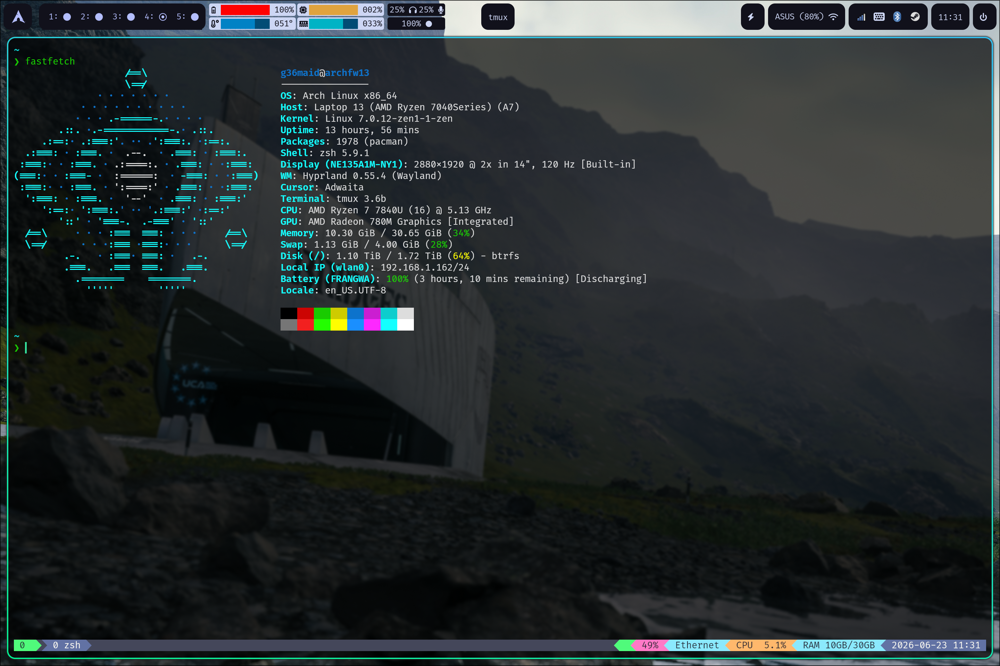

# dotfiles

My Arch Linux + Hyprland dotfiles, managed with [GNU Stow](https://www.gnu.org/software/stow/).

## screenshots



## Contents

- [System](#system)
- [Requirements](#requirements)
  - [Core (pacman)](#core-pacman)
  - [Runtime deps](#runtime-deps)
  - [Fonts](#fonts)
- [Install](#install)
- [Structure](#structure)
- [Post-install steps](#post-install-steps)
  - [TPM (tmux plugin manager)](#tpm-tmux-plugin-manager)
  - [Zim (zsh framework)](#zim-zsh-framework)
  - [`oc()` — opencode + tmux wrapper](#oc--opencode--tmux-wrapper)
  - [System-level configs (not stowed)](#system-level-configs-not-stowed)
- [Pre-install: back up existing dotfiles](#pre-install-back-up-existing-dotfiles)
- [Secrets policy](#secrets-policy)
- [License](#license)

## System

- **OS**: Arch Linux
- **WM**: Hyprland 0.55+ (Wayland, Lua config)
- **Shell**: zsh (zim framework)
- **Terminal**: kitty
- **Editor**: vim + zed
- **Input method**: fcitx5 (mcbopomofo)

## Requirements

### Core (pacman)

```bash
sudo pacman -S --needed stow zsh tmux vim kitty hyprland waybar wofi \
  fastfetch fcitx5 zellij yazi btop htop bottom bashtop lazygit lazydocker \
  starship gdb zimfw zoxide
```

### Runtime deps

Additional binaries referenced by Hyprland keybinds and `modules/autostart.lua`. Without these, the corresponding keys / tray icons will silently do nothing:

```bash
sudo pacman -S --needed hyprshot hypridle hyprlock hyprpaper playerctl \
  brightnessctl wireplumber network-manager-applet blueman
```

| Tool | Where it's used |
|---|---|
| `hyprshot` | Screenshot binds — `Print` (output), `Super+Print` (window), `Shift+Print` (region) |
| `playerctl` | Media keys (`XF86AudioNext/Play/Prev`) |
| `brightnessctl` | Brightness + keyboard-backlight keys |
| `wireplumber` (`wpctl`) | Volume up/down/mute + mic mute keys |
| `nm-applet` / `blueman-applet` | Autostart tray icons (network / bluetooth) |
| `hypridle` / `hyprlock` / `hyprpaper` | Autostart (idle daemon, screen locker, wallpaper) |

### Fonts

A **Nerd Font** is required — kitty, starship, waybar, and yazi all render Nerd Font glyphs, and kitty is pinned to `FiraCode Nerd Font`:

```bash
sudo pacman -S --needed ttf-firacode-nerd
```

> TPM (tmux plugin manager) is installed via git clone — see [Post-install steps](#tpm-tmux-plugin-manager).

## Install

```bash
git clone git@github.com:G36maid/dotfiles.git ~/Github/dotfiles
cd ~/Github/dotfiles

# Stow every package (symlinks into $HOME).
# --target="$HOME" is required because the repo isn't cloned directly
# under $HOME (it's at ~/Github/dotfiles); stow's default target is
# the repo's parent dir (~/Github), which is wrong.
stow --target="$HOME" */

# Or pick individual packages
stow --target="$HOME" zsh hypr kitty waybar
```

To remove a package: `stow --target="$HOME" -D <package>`

> If `stow */` reports conflicts, real (non-symlink) files already exist at the target paths — see [Pre-install: back up existing dotfiles](#pre-install-back-up-existing-dotfiles).

## Structure

Each top-level directory is a Stow package that mirrors its target path under `$HOME`.

| Package | Contents |
|---|---|
| `zsh/` | `.zshrc` (zim + custom `oc()` fn), `.zimrc` (zimfw modules) |
| `bash/` | `.bashrc`, `.bash_profile` |
| `tmux/` | `.tmux.conf` (dracula theme via TPM) |
| `vim/` | `.vimrc` |
| `git/` | `.gitconfig` |
| `gdb/` | `.gdbinit` |
| `starship/` | `.config/starship.toml` |
| `hypr/` | `.config/hypr/` (`hyprland.lua` + `modules/*.lua`, hypridle, hyprlock, hyprpaper) |
| `kitty/` | `.config/kitty/kitty.conf` |
| `wofi/` | `.config/wofi/` (launcher + menus) |
| `waybar/` | `.config/waybar/` (bar + power menu) |
| `fastfetch/` | `.config/fastfetch/` (with lain logos) |
| `fcitx5/` | `.config/fcitx5/` (mcbopomofo + classicui) |
| `zellij/` | `.config/zellij/config.kdl` |
| `yazi/` | `.config/yazi/` |
| `zed/` | `.config/zed/` (settings, keymap, tasks) |
| `monitors/` | `.config/{btop,htop,bottom,bashtop}/` |
| `lazytuis/` | `.config/{lazygit,lazydocker}/` |
| `opencode/` | `.config/opencode/{opencode.jsonc,package.json,rate-limit-fallback.json}`, `.config/opencode/{agents,commands}/` (custom subagents + slash commands), `.config/opencode/skills/{ghidra,git-master}/` (Agent Skills) |
| `pi/` | `.pi/agent/{settings.json,models.json,mcp.json}` (pi coding agent config; `~/.pi` path is hardcoded by pi, so the stow package adopts it. Shares skills with opencode via the `skills` setting. `auth.json` (API keys), `sessions/`, and `bin/` are runtime data, gitignored) |
| `misc/` | `.config/`: `hyfetch.json`, `dolphinrc`, `mimeapps.list`, `code-flags.conf` |

> Two user-level configs are deliberately **not** stowed or tracked: `~/.config/btop/btop.conf` and `~/.config/QtProject.conf`. Both are rewritten by their own applications at runtime (btop persists its full state whenever you change theme/settings in the TUI; Qt apps continuously update window geometry and dialog state), so a symlink into this repo would produce endless noise diffs. They live as real files in `$HOME` (gitignored here); on a fresh machine just launch each app once and it regenerates sensible defaults.

> Since Hyprland 0.55 the config is **Lua**: `hyprland.lua` requires per-concern files under `.config/hypr/modules/` (`monitors`, `env`, `look`, `input`, `binds`, `rules`, `autostart` — all `.lua`). Edit one concern without touching the rest. Per-host differences (monitors, env, sensitivity, binds, …) live in `modules/machine.lua` as profiles — a `default` base plus named overrides (`archfw13`, `g36archpc`, …); set `current` there per host and the rest of the tree stays identical across machines.

## Post-install steps

### TPM (tmux plugin manager)

`.tmux.conf` references TPM. After stowing:

```bash
git clone https://github.com/tmux-plugins/tpm ~/.tmux/plugins/tpm
tmux source ~/.tmux.conf
# Press prefix + I (capital i) inside tmux to install plugins
# (prefix is Ctrl+b — see `set -g prefix C-b` in .tmux.conf)
```

### Zim (zsh framework)

`.zshrc` bootstraps zim automatically on first login. The bootstrap prefers the pacman-installed `/usr/share/zimfw/zimfw.zsh` and falls back to the official installer's `${ZIM_HOME}/zimfw.zsh` (user-installed), so it works on both Arch and distros where zim is installed via the official installer. Just make sure the `zimfw` package (listed in [Requirements](#requirements)) is installed — zim will self-initialize on first shell launch. On Debian/Ubuntu, also set `skip_global_compinit=1` in `~/.zshenv` to avoid double `compinit` with the distro's `/etc/zsh/zshrc`.

### `oc()` — opencode + tmux wrapper

`.zshrc` defines an `oc()` function that launches [opencode](https://opencode.ai/) inside a dedicated tmux session, named after the current directory, and auto-selects a free port in `4096–5096` (exported as `$OPENCODE_PORT`):

```bash
oc            # fresh named session for $PWD, attaches if it already exists
oc --resume   # any args pass through to opencode
```

- If a session named `<dir>-<hash>` already exists for this path, it re-attaches instead of spawning a duplicate.
- Already inside tmux? It opens a new window in the current session rather than nesting.

### opencode provider keys (`auth.json`, stowed + gitignored)

Provider API keys are kept in the **stowed**, **gitignored** file
`opencode/.local/share/opencode/auth.json`, which is symlinked to
`~/.local/share/opencode/auth.json`. This repo is public, so the secret
content is never committed (`.gitignore` rule:
`**/.local/share/opencode/auth.json`); the file's *location* is maintained
through stow so the structure transfers, but each machine must supply its own
keys. Format (as written by `opencode auth login` / `/connect`):

```json
{
  "zai-coding-plan": { "type": "api", "key": "..." },
  "opencode":        { "type": "api", "key": "..." }
}
```

`opencode.jsonc` references keys only via the auth store — no `{env:...}` and
no inline `apiKey`, so nothing secret lives in a tracked file. To use on a
fresh machine, place your own `auth.json` at that path (or run
`opencode auth login`), then `stow opencode`.

### System-level configs (not stowed)

`pacman.conf` and `paru.conf` live under `/etc/` and are not tracked here — they're upstream-managed (pacman ships `.pacnew` updates) and not worth fighting stow's `$HOME` model for. Reproduce the customizations manually:

**`/etc/pacman.conf`** — enable `Color`, `ParallelDownloads`, and `[multilib]`:

```bash
sudo sed -i \
  -e 's/^#Color$/Color/' \
  -e 's/^#ParallelDownloads = 5$/ParallelDownloads = 5/' \
  -e '/^\[multilib\]$/,/^Include = \/etc\/pacman.d\/mirrorlist$/ s/^#//' \
  /etc/pacman.conf
```

**`/etc/paru.conf`** — restore via paru's own save flag (preferred over editing by hand):

```bash
paru --bottomup --devel --provides --pgpfetch --fm yazi --save
```

## Pre-install: back up existing dotfiles

`stow */` symlinks these files into `$HOME`. If real (non-symlink) versions already exist at the target paths, stow will refuse with a conflict. Move them aside first:

```bash
mkdir -p ~/.config-backup
mv ~/.zshrc ~/.zimrc ~/.tmux.conf ~/.vimrc ~/.gitconfig ~/.gdbinit \
   ~/.bashrc ~/.bash_profile ~/.config-backup/ 2>/dev/null
stow --target="$HOME" */
```

Alternatively, `stow --target="$HOME" --adopt */` overwrites the stow package's copy with your existing files (useful if you want to capture your current setup into this repo).

## Secrets policy

This repo is **public**. The `.gitignore` blocks known secret-bearing files (`hosts.yml`, `development_credentials`, `*.session`, SSH/GPG/Docker/K8s dirs, `.npmrc`, `.claude.json`, etc.). Verify with:

```bash
git ls-files | xargs grep -Eni 'gh[ops]_|sk-or-|api_key|token|password|SECRET' || echo clean
```

## License

No license file is included. These are personal configs shared publicly for reference; default copyright applies — fork and adapt for your own use, but no rights are formally granted.
